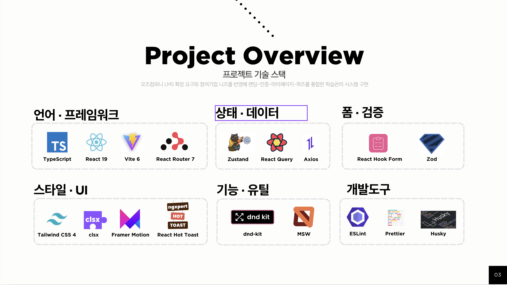

# StudyHub Frontend (OZ Externship FE Team3)

## 📖 프로젝트 소개
StudyHub는 오즈코딩스쿨 LMS 확장 요구사항을 반영한 학습관리 프론트엔드 프로젝트입니다.  
랜딩 페이지를 시작으로 인증(로그인/회원가입/소셜 로그인/계정 복구), 마이페이지, 쪽지시험 흐름을 하나의 서비스 경험으로 연결하는 것을 목표로 개발했습니다.

### 주요 기능
- 랜딩 페이지: 탭 기반 미리보기와 반응형 UI 제공
- 인증: 일반 로그인/회원가입, 소셜 로그인(카카오/네이버), 아이디/비밀번호 찾기
- 사용자 영역: 마이페이지 프로필 조회/수정, 비밀번호 변경
- 쪽지시험: 목록 조회, 응시, 결과 확인, 상태 기반 진행 제어

## 🧰 사용 스택
> 발표 자료의 기술 스택 스크린샷 기준으로 정리

## 🔗 배포 링크
- https://oz-externship-fe-06-team3.vercel.app/

## 👥 팀 동료
- 최진명: 팀장. 랜딩페이지, 로그인/회원가입, 아이디/비밀번호 찾기 UI 제작 및 기능 구현 담당. 공통 컴포넌트 `Input` 담당.
- 최준원: 마이페이지, 내 정보 수정, 비밀번호 변경, 회원 탈퇴의 UI 제작 및 기능 구현 담당. 공통 컴포넌트 `Button` 담당.
- 김소연: 헤더 프로필 드롭다운, 수강생 등록, 쪽지시험 목록/참여/응시/결과 UI 제작 및 기능 구현 담당. 공통 컴포넌트 `Modal/Popup` 담당.
- 강지훈: 쪽지시험 파트(MSW, 타이머/상태체크, 부정행위 감지, 멀티타입/주관식 문제 컴포넌트), 소셜 로그인, 탈퇴회원 복구 기능 구현 담당. 공통 컴포넌트 `Dropdown` 담당.

## 📑 프로젝트 규칙
### 이슈 관리
- GitHub Issue Template 사용
- 타입 라벨: `feat`, `chore`, `docs`, `build`, `test`, `refactor`
- 이슈에 요약/상세/체크리스트/참고자료를 기록

### PR 규칙
- PR 템플릿 기반 작성
- 필수 항목: 연관 이슈, 구현 사항, 고민한 점, 구현 이미지, 코드 설명, 리뷰 요청사항

### 커밋 컨벤션
- Conventional Commit 기반 (`commitlint` 적용)
- 허용 타입: `feat`, `fix`, `chore`, `docs`, `build`, `test`, `refactor`, `hotfix`
- 예시: `feat: 로그인 API 연동`

### 품질 게이트
- `pre-commit`: `lint-staged` 실행
- `pre-push`: `npm run build` 실행
- 코드 스타일: ESLint + Prettier 기준으로 통일
